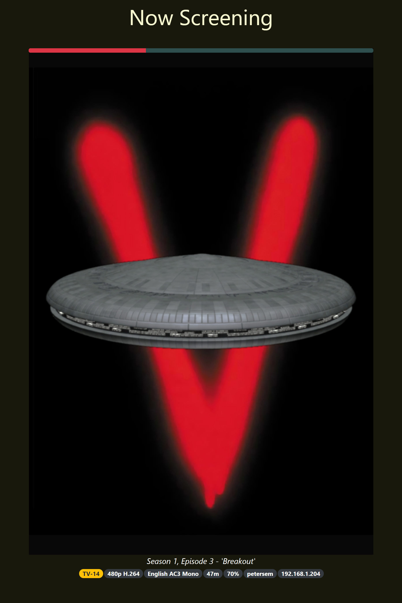
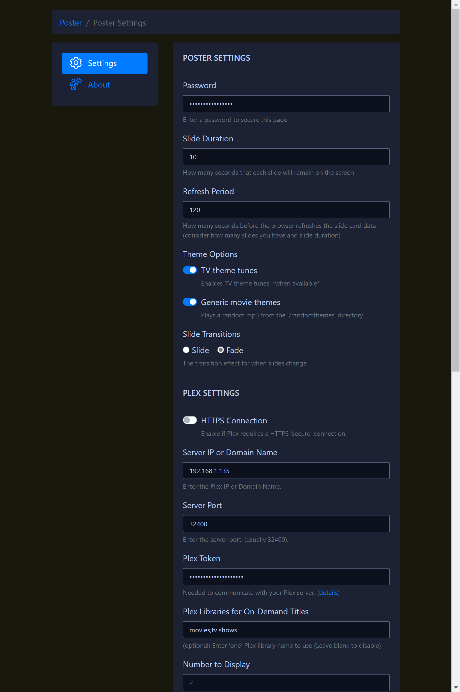

# poster
Media display software for Plex, Sonarr and Radarr.




### Installation
Installation as a Docker container is currently the only supported install

#### Docker Compose
```ya
version: '2.4'

services:
  poster:
    image: petersem/poster
    container_name: poster
    environment:
      TZ: Australia/Brisbane
    volumes:
      - ./docker/poster/public/randomthemes:/usr/src/app/public/randomthemes
      - ./docker/poster/config:/usr/src/app/config
    ports:
      - 3000:3000
```
## License

MIT

**Free Software, Hell Yeah!**
